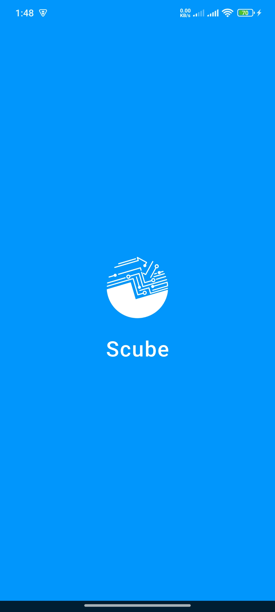
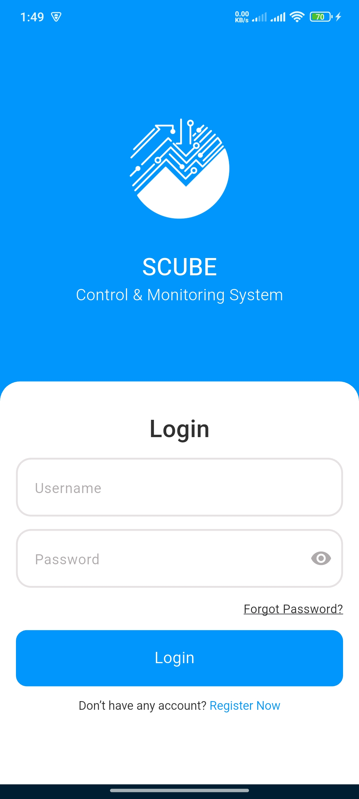
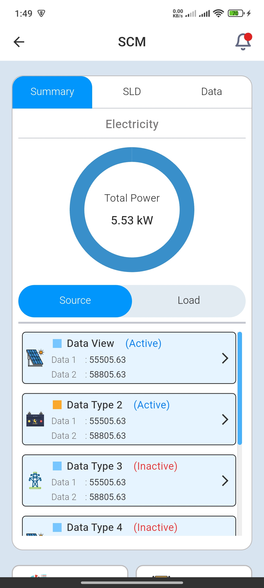
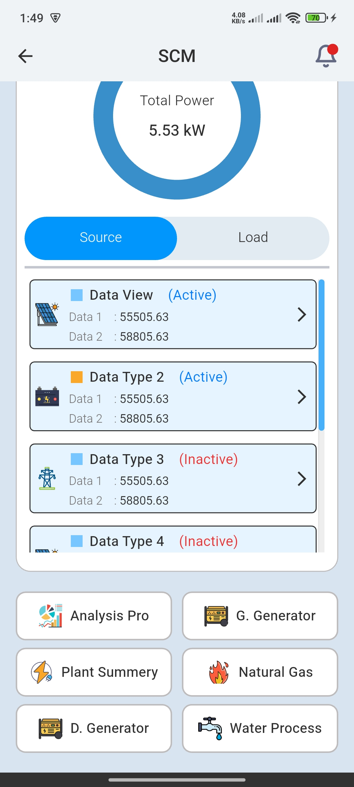
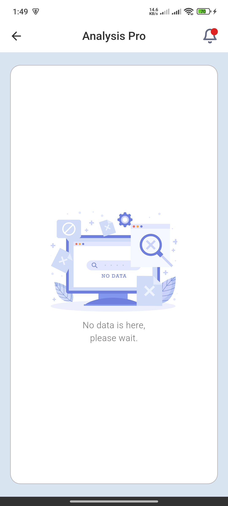
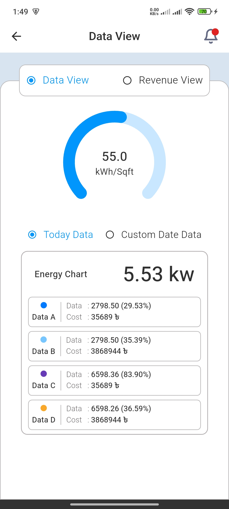
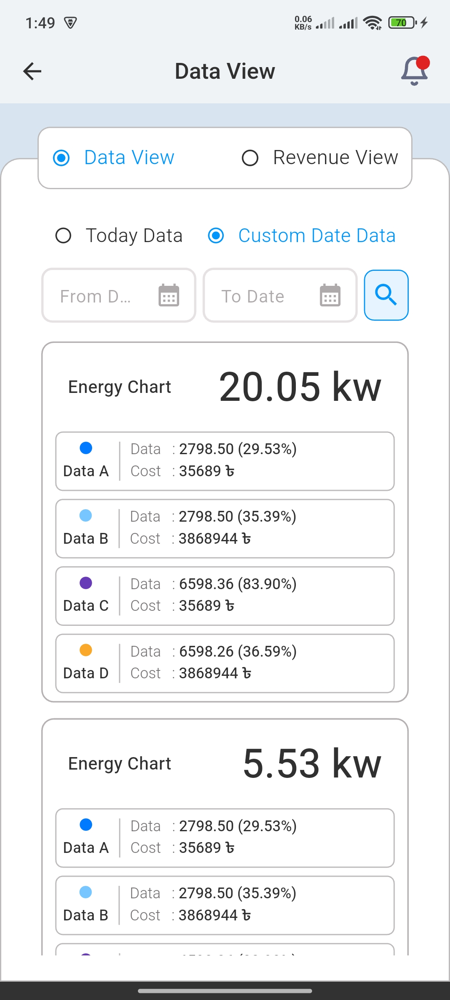
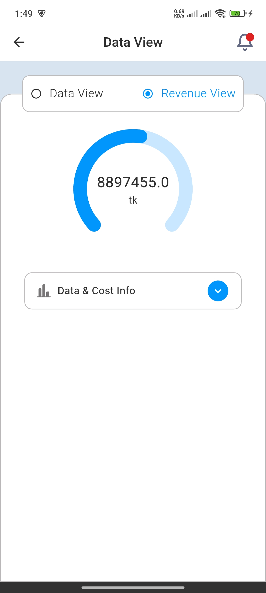
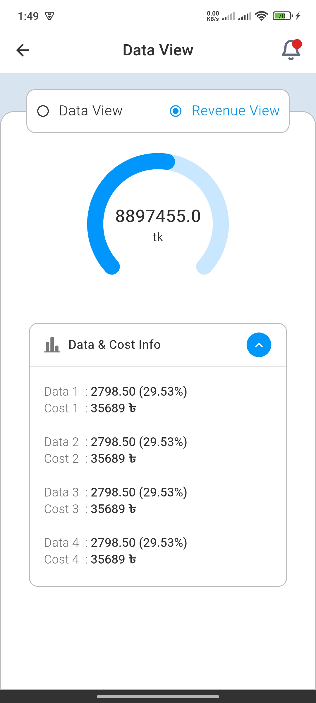

# SCUBE - Control & Monitoring System 🌐

A Flutter UI demonstration project showcasing a modern industrial control and monitoring system interface. This application was developed as part of a job assessment to demonstrate Flutter development skills, clean architecture implementation, and UI/UX design capabilities.

> **Note:** This is a UI-focused project created for assessment purposes. It demonstrates frontend implementation with mock data and state management patterns.

## 📋 Project Overview

**Project Type:** Job Assessment / Portfolio Project  
**Purpose:** Demonstrate Flutter development expertise and clean architecture implementation  
**Status:** UI Implementation Complete  
**Duration:** Assessment Task

### Technologies & Concepts Demonstrated

- ✅ Flutter UI Development
- ✅ Clean Architecture (Data/Domain/Presentation)
- ✅ State Management (Provider)
- ✅ Dependency Injection (GetIt)
- ✅ Responsive Design (ScreenUtil)
- ✅ Custom Widgets & Reusability
- ✅ Third-party Package Integration
- ✅ Professional Code Organization

## 📱 Screenshots

<table>
  <tr>
    <td></td>
    <td></td>
    <td></td>
    <td></td>
  </tr>
  <tr>
    <td align="center">Splash Screen</td>
    <td align="center">Login Screen</td>
    <td align="center">SCM Dashboard</td>
    <td align="center">Module Options</td>
  </tr>
  <tr>
    <td></td>
    <td></td>
    <td></td>
    <td></td>
  </tr>
  <tr>
    <td align="center">Analysis Pro</td>
    <td align="center">Data View</td>
    <td align="center">Custom Date Filter</td>
    <td align="center">Energy Charts</td>
  </tr>
  <tr>
    <td></td>
    <td></td>
  </tr>
  <tr>
    <td align="center">Revenue View</td>
    <td align="center">Cost Breakdown</td>
  </tr>
</table>

## ✨ Key Features Implemented

- 🔐 **Authentication UI** - Login screen with form validation and password visibility toggle
- 📊 **Dashboard Interface** - Multi-tab layout with Summary, SLD, and Data sections
- ⚡ **Circular Progress Gauges** - Using Syncfusion Flutter Gauges for power visualization
- 📈 **Data Visualization** - Interactive UI for energy and revenue data display
- 📅 **Date Picker Integration** - Custom date range selection interface
- 💰 **Cost Breakdown Views** - Detailed data presentation with expandable sections
- 🏭 **Module Navigation** - Multiple plant monitoring options (Analysis Pro, Generator, Natural Gas, Water Process)
- 📱 **Responsive Design** - Screen adaptation using flutter_screenutil
- 🎨 **Modern UI/UX** - Clean interface with smooth animations, shimmer loading effects, and cached images
- 🏗️ **Clean Architecture** - Proper separation of Data, Domain, and Presentation layers

## 🏗️ Architecture

This project follows **Clean Architecture** principles with a clear separation of concerns:

```
lib/
├── app/
│   ├── app_dependencies.dart      # Dependency Injection Setup
│   ├── provider_list.dart         # State Management Providers
│   └── exports.dart               # Central Export File
├── features/
│   └── scm/
│       ├── data/                  # Data Layer
│       │   ├── datasources/       # API & Local Data Sources
│       │   ├── models/            # Data Models
│       │   └── repositories/      # Repository Implementations
│       ├── domain/                # Domain Layer
│       │   ├── entities/          # Business Entities
│       │   ├── repositories/      # Repository Interfaces
│       │   └── usecases/          # Business Logic
│       └── presentation/          # Presentation Layer
│           ├── screens/           # UI Screens
│           ├── widgets/           # Reusable Widgets
│           └── providers/         # State Management
└── core/                          # Shared Resources
    ├── constants/                 # App Constants
    ├── utils/                     # Utility Functions
    └── theme/                     # App Theme
```

### Architecture Layers

- **Data Layer**: Handles data operations (API calls, local storage, data models)
- **Domain Layer**: Contains business logic and entities (use cases, repository contracts)
- **Presentation Layer**: UI components and state management (screens, widgets, providers)

## 🎯 State Management

This app uses **Provider** for state management, offering:

- Simple and scalable state management solution
- Efficient widget rebuilding
- Easy dependency injection
- Clear separation between business logic and UI

## 📦 Key Packages Used

### Core Dependencies

| Package     | Version  | Purpose                                  |
| ----------- | -------- | ---------------------------------------- |
| `provider`  | ^6.1.5+1 | State management solution                |
| `go_router` | ^17.0.0  | Declarative routing and navigation       |
| `get_it`    | ^9.2.0   | Service locator for dependency injection |
| `logger`    | ^2.6.2   | Elegant logging for debugging            |

### UI & Visualization

| Package                     | Version  | Purpose                                |
| --------------------------- | -------- | -------------------------------------- |
| `syncfusion_flutter_gauges` | ^32.1.19 | Beautiful circular progress indicators |
| `flutter_screenutil`        | ^5.9.3   | Responsive UI across screen sizes      |
| `flutter_svg`               | ^2.2.3   | SVG rendering support                  |
| `shimmer`                   | ^3.0.0   | Skeleton loading effects               |
| `flutter_spinkit`           | ^5.2.2   | Animated loading indicators            |
| `cached_network_image`      | ^3.4.1   | Optimized image loading & caching      |

## 🎯 Project Context

This project was created as a **job assessment task** to demonstrate:

- Flutter UI development proficiency
- Clean Architecture implementation
- State management with Provider
- Modern UI/UX design principles
- Professional code organization and structure

## 🚀 Getting Started

### Prerequisites

- Flutter SDK: `^3.9.2` or higher
- Dart SDK: `^3.9.2` or higher
- Android Studio / VS Code with Flutter extensions
- Android/iOS device or emulator

### Installation

1. **Clone the repository**

```bash
git clone https://github.com/yourusername/scube_task_app.git
cd scube_task_app
```

2. **Install dependencies**

```bash
flutter pub get
```

3. **Run the app**

```bash
flutter run
```

### Build for Release

**Android APK:**

```bash
flutter build apk --release
```

**iOS:**

```bash
flutter build ios --release
```

## 🎨 App Structure & UI Screens

### Main Screens Implemented

1. **Splash Screen**: App branding and initial loading
2. **Login Screen**: Authentication interface with form validation
3. **SCM Dashboard**: Central hub with three tabs (Summary, SLD, Data)
4. **Data View**: Energy consumption visualization with data/revenue toggle
5. **Revenue View**: Financial analysis with expandable cost breakdowns
6. **Analysis Pro**: Empty state implementation with proper error handling
7. **Module Selection**: Grid view of available plant monitoring options

### UI Components Built

- Custom circular progress gauges (Syncfusion)
- Reusable card widgets
- List items with active/inactive states
- Date picker dialogs
- Tab navigation
- Shimmer loading effects
- Expandable sections

## 🔧 Configuration

The app uses dependency injection with `get_it` for service management. All dependencies are configured in:

- `lib/app/app_dependencies.dart` - Dependency injection setup
- `lib/app/provider_list.dart` - State management providers

## 🎓 Learning Outcomes

This project demonstrates:

- Implementation of Clean Architecture in Flutter
- Effective state management using Provider
- Integration of multiple third-party packages
- Responsive UI design principles
- Code organization and maintainability
- Professional Git workflow

## ⚠️ Disclaimer

This is a **demonstration/assessment project** created to showcase Flutter development skills. The app uses mock data and is designed primarily for UI/UX demonstration purposes. It is not connected to any real backend services.

## 📝 License

This project is open source and available for educational and portfolio purposes.

## 🤝 Connect

This project is part of my Flutter development portfolio. Feel free to explore the code and reach out for any discussions about Flutter development or potential opportunities.

---

**Built with ❤️ using Flutter**  
_A job assessment project showcasing modern Flutter development practices_
